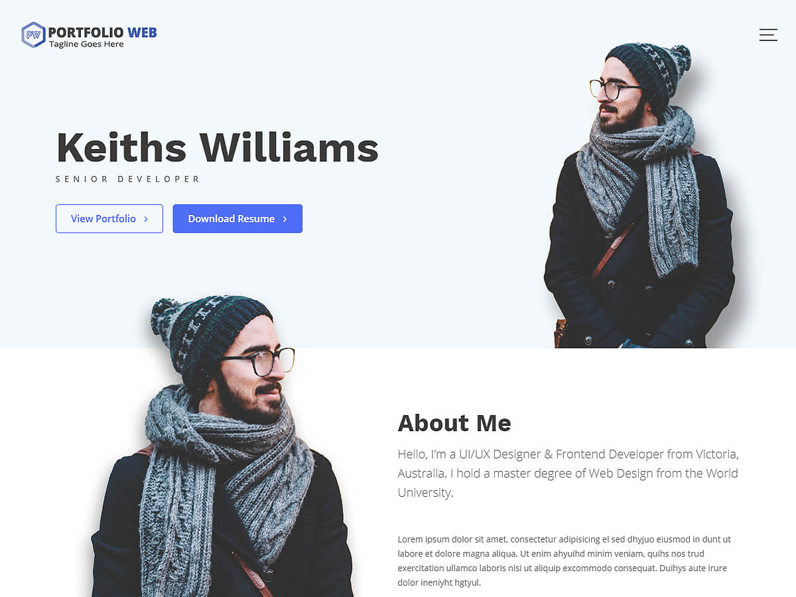

# Portfolio Web

**Contributors:** acmethemes  
**Requires at least:** 6.6  
**Tested up to:** 7.0  
**Requires PHP:** 7.4  
**Stable tag:** 4.0.0  
**License:** GPLv2 or later  
**License URI:** https://www.gnu.org/licenses/gpl-2.0.html  

> 

Portfolio Web is a minimalist, sleek WordPress theme designed specifically for showcasing creative work. Perfect for designers, photographers, agencies, and freelancers — its clean layout puts your projects front and center, while the live customizer makes updating your portfolio effortless.

## Features

- **Featured slider** — make a strong first impression with your best work
- **Up to four-column layouts** — flexible grids for project galleries
- **Custom header & background** — brand your portfolio your way
- **Custom logo & menu** — full control over site identity
- **Sidebar options** — left, right, or full-width layouts
- **Social media integration** — link to Dribbble, Behance, LinkedIn, and more
- **Custom copyright text** — personalized footer credit
- **Breadcrumb navigation** — clear, SEO-friendly structure
- **Translation ready** — .pot file included
- **RTL support** — right-to-left language compatible
- **Responsive** — looks stunning on every device

## Installation

1. Download the theme zip file.
2. In your WordPress admin, go to **Appearance → Themes**.
3. Click **Add New** → **Upload Theme**.
4. Select the zip file and click **Install Now**.
5. Click **Activate**.

## Frequently Asked Questions

### How do I install the theme?

In your admin panel, go to **Appearance → Themes**, click **Add New**, search for "Portfolio Web," or upload the zip file directly.

### How do I set up the front page?

Create a new page, go to **Settings → Reading**, and set it as the static front page. The "Home Main Content Area" sidebar will display on the homepage.

### How do I customize the site?

Go to **Appearance → Customize** to configure layout, colors, featured content, and widgets.

## Credits

Portfolio Web is built on [Underscores](https://underscores.me/) and licensed under GPLv2 or later. It bundles the following third-party resources:

- [Google Fonts](https://fonts.google.com/) — Apache License 2.0
- [Font Awesome](https://fontawesome.com/) — MIT / SIL OFL 1.1
- [normalize.css](https://necolas.github.io/normalize.css/) — MIT
- [Bootstrap](http://getbootstrap.com/) — MIT
- [CountUp.js](https://github.com/inorganik/CountUp.js) — MIT
- [Isotope](https://isotope.metafizzy.co/) — GPLv3
- [Magnific Popup](https://github.com/dimsemenov/Magnific-Popup) — MIT
- [Theia Sticky Sidebar](https://github.com/WeCodePixels/theia-sticky-sidebar) — MIT
- [Breadcrumb Trail](https://github.com/justintadlock/breadcrumb-trail) — GPLv2+
- [TGM Plugin Activation](http://tgmpluginactivation.com/) — GPLv2+
- [html5shiv](https://github.com/afarkas/html5shiv) — MIT
- [Respond.js](https://github.com/scottjehl/Respond) — MIT
- [Waypoints](https://github.com/imakewebthings/waypoints/) — MIT
- [WOW](https://github.com/matthieua/WOW) — MIT
- [Slick](https://github.com/kenwheeler/slick/) — MIT
- [Easy Pie Chart](https://github.com/rendro/easy-pie-chart/) — MIT/GPL

---

[Support](https://www.acmethemes.com/supports/) &middot; [Acme Themes](https://www.acmethemes.com)
